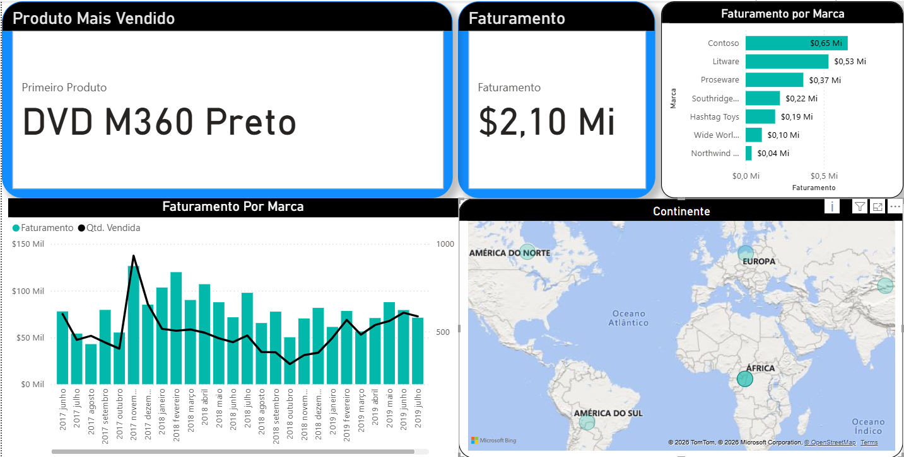
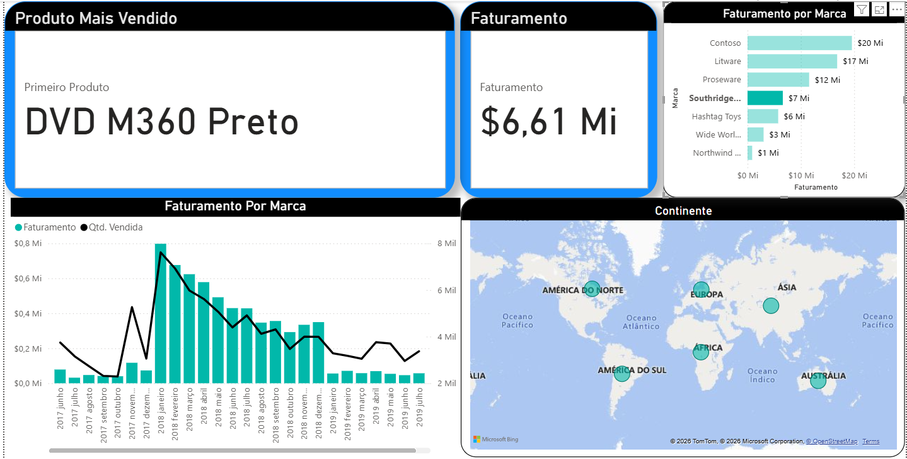

# 📊 Dashboard de Vendas e Performance (Hashtag Programação)

Projeto prático desenvolvido para análise de indicadores de vendas, faturamento e distribuição geográfica, utilizando Power BI e tratamento de dados.

## 🚀 Funcionalidades e Insights
O dashboard permite uma análise dinâmica através de:
* **Análise Geográfica:** Filtros por mapa que mostram o desempenho por região.
* **Faturamento por Marca:** Visão detalhada de receita filtrada por fabricantes.
* **KPIs Estratégicos:** Total de faturamento, custo e margem de lucro.

## 📸 Visualização do Projeto

### Filtro Dinâmico por Região

### Faturamento por Marca e Categoria

## 🛠️ Tecnologias Utilizadas
* **Power BI:** Modelagem de dados e criação de visualizações.
* **Power Query (M):** Limpeza e transformação da base de dados `Vendas.csv`.
* **DAX:** Criação de medidas para cálculo de performance.

## 📁 Como visualizar
1. Baixe o arquivo `Aula 1 - Do Zero.pbix` presente neste repositório.
2. Abra no **Power BI Desktop**.
